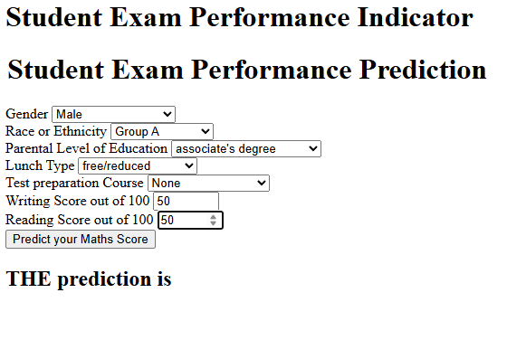
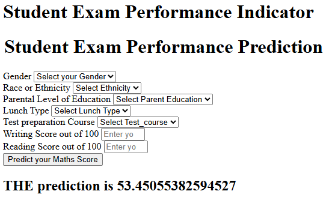

# 🎓 Student Exam Performance Prediction

This project is part of a **learning-based project from a Udemy [Complete Data Science, Machine Learning, DL, NLP Bootcamp](https://www.udemy.com/certificate/UC-14b8d5ed-d5a1-4bb7-95c6-1788c0df30b9/)**.  
The objective of this project is to **analyze factors affecting student exam performance**, build a **regression model to predict math scores**, and understand the **end-to-end machine learning workflow**, including analysis, model training, modular pipeline development, and deployment.

> ⚠️ This project is **not a final capstone project**, but a guided project completed as part of a structured learning process.

---

## 📌 Project Objectives

1. Perform **Exploratory Data Analysis (EDA)** on student performance data.
2. Train and evaluate multiple **regression models**.
3. Build a **modular machine learning pipeline** with logging and exception handling.
4. Deploy the trained model using **Flask for offline inference**.
5. Understand **cloud deployment workflows** (AWS & Azure).

---

## 📊 Dataset Overview

- **Dataset**: Student Performance in Exams  
- **Source**: Kaggle  
- **Shape**: 1000 rows × 8 columns  
- **Type**: Tabular data (categorical & numerical)

### Features
| Feature | Description |
|------|------------|
| gender | Student gender |
| race_ethnicity | Race / ethnicity group |
| parental_level_of_education | Parent education level |
| lunch | Lunch type |
| test_preparation_course | Test preparation status |
| reading_score | Reading score (0–100) |
| writing_score | Writing score (0–100) |

### Target Variable
- **math_score** (Regression)

---

## 🔍 Exploratory Data Analysis (EDA)

EDA is conducted using Jupyter Notebook to:
- Validate data quality (missing values, duplicates, data types)
- Analyze score distributions
- Compare student performance across demographic and socio-economic factors
- Create additional features such as:
  - Total Score
  - Average Score

### Key Insights
- Female students show higher average overall performance.
- Students with **standard lunch** tend to score higher consistently.
- Math scores exhibit higher variance compared to reading and writing.
- Reading and writing scores are strongly correlated with math scores.


---

## 🧠 Model Training & Evaluation

### Preprocessing
- Categorical features encoded using **One-Hot Encoding**
- Numerical features scaled using **StandardScaler**
- Implemented using `ColumnTransformer`

### Models Evaluated
- Linear Regression
- Ridge & Lasso Regression
- KNN Regressor
- Decision Tree
- Random Forest
- XGBoost
- CatBoost
- AdaBoost

### Evaluation Metrics
- MAE
- RMSE
- R² Score

### Final Model
- **Selected Model**: Linear Regression
- **Test R² Score**: ~0.88


---

## ⚙️ Machine Learning Pipeline

1. **Data Ingestion**

   * Load raw dataset
   * Train-test split

2. **Data Transformation**

   * Feature encoding & scaling
   * Save preprocessing pipeline

3. **Model Training**

   * Train multiple regression models
   * Compare performance
   * Persist best model

4. **Prediction Pipeline**

   * Load trained model & preprocessor
   * Perform inference on new input data

---

## 🌐 Deployment

### Offline Deployment (Implemented)

The project includes an **offline Flask web application** that allows users to:

* Input student indicators
* Predict math scores locally

**Access URL:**

```
http://127.0.0.1:5000/predictdata
```



---

### Cloud Deployment (Planned / Not Executed)

As part of the bootcamp curriculum, cloud deployment pipelines were designed for:

* **AWS Elastic Beanstalk**
* **AWS EC2 with ECR (Docker-based deployment)**
* **Azure Container & Image Deployment**

However, these deployments were **not executed** due to **resource and billing constraints**.

> The focus of this project remains on understanding the **deployment architecture and workflow**, even though cloud execution was skipped.

---

## 🛠️ Tech Stack

* **Language**: Python
* **Core Libraries**: pandas, numpy, scikit-learn
* **Visualization**: matplotlib, seaborn
* **ML Libraries**: xgboost, catboost
* **Deployment**: Flask
* **Version Control**: Git & GitHub

---

## 📚 Learning Outcomes

This project helped me understand:

* End-to-end ML project structuring
* Modular pipeline design
* Logging & exception handling
* Model evaluation & selection
* Offline deployment using Flask
* Cloud deployment concepts (AWS & Azure)
